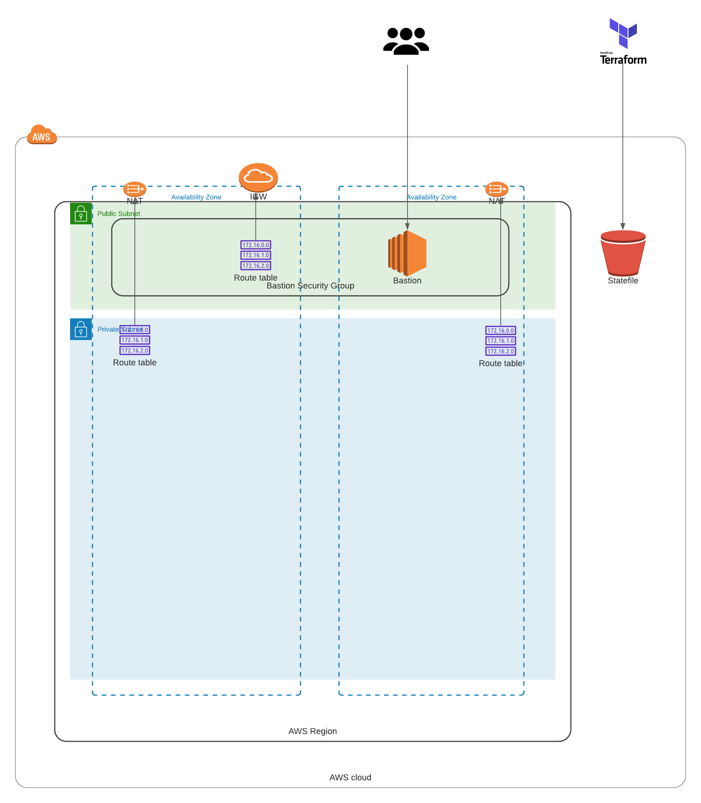

## Summary

This repo will create a create your custom EKS environment.

## Basic Architecture



## Built with:

* Terraform (v1.0.4)
* AWS_ACCESS_KEYS and AWS_SECRET_ACCESS_KEYS are set as environment variables (link: https://docs.aws.amazon.com/cli/latest/userguide/cli-configure-envvars.html)

### Step by Step deployment
* **Step 1: Clone the Repo**. This command will clone the repo and will change directory the recently cloned repo
```shell script
$ git clone https://github.com/antonio-rufo/tf-kenjerman.git
```

* **Step 2: Create a S3 bucket for remote state storage.** Update the `terraform.tfvars` file with your region and account id.
```shell script
$ cd tf-kenjerman
$ cd statebucket
$ vi terraform.tfvars
```
Create the resources:
```shell script
$ terraform init
$ terraform plan
$ terraform apply --auto-approve
```
Take note of the output for `state_bucket_id` and `state_bucket_region`. You'll need to update the `main.tf` on each layer with these values. It is not yet possible to have the state bucket values interpolated.

* **Step 3: Create custom VPC environment.** Update the `terraform.tfvars` file with your inputs. Then update `main.tf` with the **state_bucket_id** (line 10) created in step 2 as well as the **state_bucket_region** (line 12).
```shell script
$ cd ../layers/000base
$ vi terraform.tfvars
$ vi main.tf
```
Create the resources:
```shell script
$ terraform init
$ terraform plan
$ terraform apply --auto-approve
```

* **Step 4: Create your compute resources (Bastion and EKS cluster).** Update the `terraform.tfvars` file with your inputs. Then update `main.tf` with the **state_bucket_id** (lines 10 and 37) created in step 2 as well as the **state_bucket_region** (lines 12 and 39).
```shell script
$ cd ../layers/200compute
$ vi terraform.tfvars
$ vi main.tf
```
Create the resources:
```shell script
$ terraform init
$ terraform plan
$ terraform apply --auto-approve
```

* **Step 5: Create your AWS managed services (Elasticsearch, DocumentDB, MSK, RDS and S3 Bucket).** Update the `terraform.tfvars` file with your inputs. Then update `main.tf` with the **state_bucket_id** (lines 10, 37, and 50) created in step 2 as well as the **state_bucket_region** (lines 12, 39, and 52).
```shell script
$ cd ../layers/100data
$ vi terraform.tfvars
$ vi main.tf
```
Create the resources:
```shell script
$ terraform init
$ terraform plan
$ terraform apply --auto-approve
```
